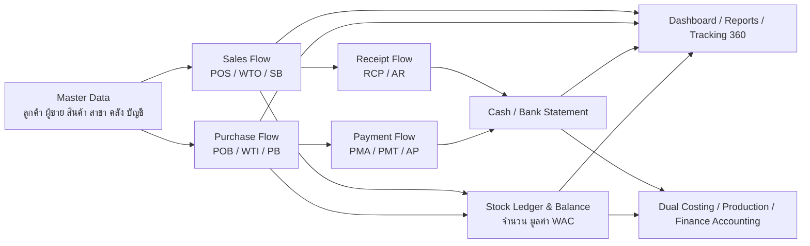

# Scrap ERP: สรุป Module และ Flow งานสำหรับนำเสนอ

เอกสารนี้ใช้เป็นภาพรวมสำหรับ demo, present feature, และคุยขายระบบ Scrap ERP โดยสรุปจาก active Next app และเอกสาร flow ปัจจุบันของโครงการ

> หมายเหตุ: เอกสารนี้เป็น business-facing summary ไม่ใช่ contract รายละเอียดเชิง implementation. ถ้าต้องยืนยันกติกาเฉพาะหน้า ให้ดูเอกสาร flow รายหมวดใน `docs/notes/` และ `docs/notes/page-flows/`.

## Positioning

Scrap ERP คือระบบ ERP สำหรับธุรกิจรับซื้อ-ขายเศษโลหะและโรงงานแปรรูป ที่ออกแบบให้เชื่อมงานหน้าลาน, ออฟฟิศ, สต๊อก, การเงิน, และรายงานผู้บริหารไว้ใน flow เดียวกัน

จุดขายหลัก:

- เห็นเส้นทางเอกสารตั้งแต่ `PO -> ใบรับ/ส่งของ -> บิล -> จ่าย/รับเงิน -> รายงาน`
- แยก Stock, Trading, Finance, และ Accounting ชัดเจน ลดการตีความผิดจากข้อมูลชุดเดียวกัน
- ใช้ document number และ timeline เพื่อตรวจสอบย้อนหลังได้
- สต๊อกใช้ ledger และ WAC เป็นฐาน ไม่ใช่ยอดกรอกมือ
- รองรับธุรกิจ scrap ที่มีน้ำหนัก, สิ่งเจือปน, หน่วยสินค้า, cost allocation, และ stock status หลายชั้น
- มี dashboard, tracking, และ report สำหรับเจ้าของกิจการและทีมปฏิบัติการ

## Executive View

| พื้นที่งาน | สิ่งที่ระบบช่วย | คุณค่ากับธุรกิจ |
|---|---|---|
| รับซื้อ | จองซื้อ, รับของ, ออกบิลรับซื้อ, ตั้งเจ้าหนี้ | ลดงานซ้ำและเห็นยอดซื้อค้างรับ/ค้างจ่ายชัดเจน |
| ขาย | จองขาย, ส่งของ, ออกบิลขาย, รับเงิน | คุมของออก, ลูกหนี้, กำไร และการรับเงินจริงใน flow เดียว |
| สต๊อก | Ledger, balance, WAC, pending out, transfer, adjust | รู้จำนวนพร้อมใช้ มูลค่า และต้นทุนเฉลี่ยย้อนหลังได้ |
| การเงิน | อนุมัติจ่าย, จ่ายเงิน, รับเงิน, AR/AP, cash/bank | เห็นหนี้ เงินเข้า-ออก และสภาพคล่องแบบ daily operation |
| บัญชีบริหาร | P&L, balance sheet, cash flow, asset, loan, tax | ใช้ตัวเลข operational facts ทำ management reporting |
| Dual Costing | จัดสรรต้นทุนดีลทองแดง/ทองเหลือง | ดู margin แบบ deal-by-deal แยกจาก WAC ปิดงบ |
| Production | ใบสั่งผลิต, input, output, WIP, yield, loss | วัดประสิทธิภาพโรงงานและผลกระทบต่อ stock |
| Tracking 360 | Customer, Supplier, Product view | เห็น performance รอบด้านเพื่อเลือกคู่ค้าและสินค้าให้ดีขึ้น |
| Admin & Control | User, permission, audit, company print profile | คุมสิทธิ์ ข้อมูลหัวเอกสาร และตรวจสอบการใช้งาน |

## End-to-End Business Flow



## Module Summary

### 1. Master Data และ Company Data

ใช้เป็นฐานกลางของทุกเอกสาร เพื่อให้ transaction ไม่กรอกข้อมูลซ้ำและไม่ใช้ชื่อ free text เป็น source of truth

Feature ที่นำเสนอ:

- จัดการลูกค้า ผู้ขาย สินค้า สาขา คลัง บัญชีบริษัท และวิธีรับ/จ่ายเงิน
- รองรับสินค้า scrap ที่มีหน่วย `กก.` และ `ลัง`
- กำหนดรายการสิ่งเจือปนสำหรับใบรับ/ส่งของ
- กำหนดบัญชีเงินสด/ธนาคาร และประเภทบัญชี
- กำหนดพนักงาน/กรรมการสำหรับเงินสำรองจ่ายและกู้กรรมการ
- ผูก Customer/Supplier กับสาขาที่ใช้งานได้ เพื่อป้องกันเลือกคู่ค้าผิดสาขา

จุดขาย:

- ข้อมูลหลักนิ่ง ทำให้เอกสาร, report, และ audit ใช้ชื่อ/รหัสเดียวกัน
- ลดปัญหา duplicate name และการเลือกคู่ค้าผิดสาขา

### 2. Purchase Flow: รับซื้อครบวงจร

Flow หลัก:

```text
PO Buy -> WTI ใบรับของ -> Purchase Bill -> Payment Approval -> Payment
```

Feature ที่นำเสนอ:

- `PO Buy` สำหรับจองซื้อและล็อกเงื่อนไขกับ Supplier
- `WTI` สำหรับรับของและยืนยันน้ำหนักขาเข้า
- บันทึก gross, หักสิ่งเจือปน, net weight, รูปหลักฐาน และทะเบียนรถ
- `Purchase Bill` แยก Stock และ Trading ชัดเจน
- Stock purchase เข้า stock และเปลี่ยน WAC ผ่าน stock ledger
- Trading purchase ไม่เข้า stock และส่งต่อไป Trading/Dual Costing
- รองรับ PO และ Spot Buy ในบิลเดียว
- รองรับเงินล่วงหน้า Supplier และการหักมัดจำตอนออกบิล
- พิมพ์เอกสาร PO/PB โดยใช้ข้อมูลบริษัทจาก Company Profile

จุดขาย:

- หน้างานชั่งรับของและออฟฟิศออกบิลใช้เอกสารต่อเนื่องกัน
- เจ้าของเห็นได้ว่ายอดซื้อไหนเข้า stock แล้ว, ตั้งเจ้าหนี้แล้ว, หรือยังรอจ่าย

### 3. Sales Flow: ขายและรับเงิน

Flow หลัก:

```text
PO Sell -> WTO ใบส่งของ -> Sales Bill -> Customer Receipt
```

Feature ที่นำเสนอ:

- `PO Sell` สำหรับจองขายหรือรับ order ล่วงหน้า
- `WTO` สำหรับส่งของและสร้าง `pending_out` ก่อนออกบิล
- `Sales Bill` เป็นจุดตั้งลูกหนี้และตัด stock จริง
- รองรับ Spot Sale เมื่อขายเกินหรือไม่ได้อ้าง PO Sell
- รองรับ Trading sale ที่ไม่ตัด stock แต่ใช้จับคู่ต้นทุนซื้อขาย
- `RCP` รับเงินลูกค้าและตัด AR
- ลูกหนี้อ่านจากยอด snapshot ของ Sales Bill ไม่คำนวณเดาจาก receipt log

จุดขาย:

- ของออกจากลานถูกกันไว้ก่อนด้วย WTO แต่ยังไม่ตัด stock จนเปิดบิลขาย
- AR, receipt, stock-out, และ COGS เชื่อมกับเอกสารจริง ตรวจย้อนกลับได้

### 4. Stock และ Warehouse Control

Feature ที่นำเสนอ:

- `Stock Ledger` เป็นประวัติ movement จริงของสินค้า
- `Stock Balance` คำนวณจาก ledger ตามสินค้า สาขา คลัง lot และสถานะ
- แสดง on hand, pending out, และ available
- รองรับ WAC/ต้นทุนเฉลี่ยจากมูลค่า stock จริง
- โอนสินค้าระหว่างสาขา/คลัง
- ปรับสถานะ RM/FG
- Grade Adjustment / ปรับเกรด
- Stock Count Adjust สำหรับแก้ยอดจากการนับจริง

จุดขาย:

- ไม่พึ่งยอด stock ที่กรอกมืออย่างเดียว แต่ trace ได้ว่า stock มาจากเอกสารใด
- รองรับทั้ง real-time และ historical as-of สำหรับรายงานย้อนหลัง

### 5. Payment, Receipt และ Finance & Debt

Feature ที่นำเสนอ:

- `Payment Approval` รวมรายการรออนุมัติจาก PB, ADV, EXP, และ PADV
- `PMA` เป็น snapshot ยอดที่อนุมัติจริง
- `PMT` เป็นเอกสารจ่ายเงินจริงและลง bank statement
- รองรับ split approval ก่อนจ่าย
- `Sales Receipts` รับเงินหลายบิลและลด AR
- `AR` อ่านยอดค้างจาก Sales Bill
- `AP` อ่านยอดค้างจาก Purchase Bill
- `Cash / Bank Statement` แสดง movement เงินเข้า-ออก
- `Cash Position` มองสภาพคล่องจาก cash, bank, AR, AP
- `Petty Advance / Director Loan` แยกเงินสำรองจ่ายและกู้กรรมการ
- `Customer Advance` แสดงเงินรับล่วงหน้าและยอดคงเหลือ

จุดขาย:

- แยก “อนุมัติจ่าย” กับ “จ่ายเงินจริง” ชัดเจน
- เจ้าของเห็นยอดค้างจ่าย, ค้างรับ, และเงินสด/ธนาคารได้เร็ว

### 6. Finance / Accounting

Feature ที่นำเสนอ:

- Financial Dashboard รายเดือน
- Cash Flow Analysis และ Cash Flow Forecast Calendar
- Working Capital Analysis
- Stock Finance Analysis
- Profit Leak Dashboard
- Tax / VAT / WHT
- Management P&L, Balance Sheet, Cash Flow Statement
- Fixed Asset Register, Depreciation, Asset Disposal
- Loan / Leasing / BSL และ Loan Dashboard
- Opening Balance และ Historical Data สำหรับ cutover
- Accounting Periods และ Posting Rules เป็น policy surface สำหรับ month/year close

จุดขาย:

- ผู้บริหารเห็นภาพรวมทางการเงินจาก transaction จริง
- วางรากฐานไปสู่ month close, year close, และ GL/statutory accounting ได้

### 7. Dual Costing และ Trading

Feature ที่นำเสนอ:

- Cost Pool สำหรับต้นทุน eligible ของทองแดง/ทองเหลือง
- Cost Allocator สำหรับจับต้นทุนกับดีลขาย
- Waiting Allocations สำหรับดีลที่ยังรอจัดสรรต้นทุน
- Allocation Ledger และ Match Log สำหรับ audit การจับคู่
- Dual Costing Report และ Deal Margin Report
- Trading Dashboard และ Trading Matching สำหรับซื้อขายผ่านมือ

จุดขาย:

- ดูกำไรแบบ deal-by-deal ได้ โดยไม่ปนกับ WAC ที่ใช้ปิดงบ
- เหมาะกับธุรกิจ scrap ที่ดีลทองแดง/ทองเหลืองต้องดูต้นทุนเฉพาะชุด

### 8. Production

Flow เป้าหมาย:

```text
Production Order -> Production Input -> WIP -> Production Output -> Yield / Loss
```

Feature ที่นำเสนอ:

- เปิดใบสั่งผลิต
- เบิกวัตถุดิบเข้า WIP
- รับผลผลิตเป็น FG/RM หรือบันทึก loss
- Production Report / Yield
- WIP คงเหลือ
- เชื่อม stock ledger ผ่าน PI/PO2 movement model
- รองรับเครื่องจักรและ production line จาก master data

จุดขาย:

- โรงงานเห็น input, output, WIP, yield, loss และต้นทุนผลิตได้ในระบบเดียวกับ stock
- ลดการแยก spreadsheet สำหรับวัด efficiency การผลิต

### 9. Dashboard, Reports และ Tracking 360

Feature ที่นำเสนอ:

- Owner Daily Control สำหรับเปิดดูทุกเช้า
- Daily Report สรุปงานรายวัน
- Analytics Dashboard วิเคราะห์ตามช่วงเวลา
- Financial Dashboard ภาพรวมการเงิน
- Profit & Cost Analysis
- Cash Flow Calendar และ Business Calendar
- Cash & Others Summary
- Customer Tracking 360
- Supplier Tracking 360
- Product Tracking 360
- รายงาน PO ซื้อ/ขายคงเหลือ
- Reports catalog รวมรายงานหลัก

จุดขาย:

- เห็นภาพรวมจาก operational data โดยไม่ต้อง export ไปทำเองทุกครั้ง
- Tracking 360 ช่วยตอบคำถามเชิงธุรกิจ เช่น ลูกค้าคนไหนกำไรดี, Supplier ไหนส่งของดี, สินค้าไหนควรซื้อขายต่อ

### 10. Admin, Permission และ Audit

Feature ที่นำเสนอ:

- Users และ Roles & Permissions
- กำหนดสิทธิ์เมนูและ action ตาม role
- Company Profile สำหรับหัวเอกสารพิมพ์
- VAT / WHT settings
- LINE Notification settings
- Transaction Ledger สำหรับตรวจเงินเข้า-ออก
- Audit & Activity Log
- Backup / Restore และ migration tooling

จุดขาย:

- คุมสิทธิ์ตามหน้าที่งาน เช่น owner, accountant, cashier, warehouse, purchaser, sales
- เอกสารพิมพ์ใช้ข้อมูลบริษัทกลาง ไม่ hardcode
- มี audit trail รองรับการตรวจสอบย้อนหลัง

## Recommended Demo Flow

ใช้ sequence นี้เพื่อ show ระบบแบบ end-to-end ภายในเวลาจำกัด

### Demo 1: รับซื้อเข้า Stock ถึงจ่ายเงิน

1. เปิด Supplier และ Product master เพื่อแสดงฐานข้อมูลกลาง
2. สร้าง PO Buy
3. สร้าง WTI รับของ พร้อมน้ำหนักและสิ่งเจือปน
4. เปิด Purchase Bill จาก WTI
5. ดู Stock Balance และ Stock Ledger ที่เกิดจาก PB
6. ไป Payment Approval เพื่ออนุมัติจ่าย
7. ทำ PMT ในหน้าจ่ายเงิน
8. ดู AP และ Cash / Bank Statement

ข้อความขาย:

> ตั้งแต่รถเข้าลานจนจ่ายเงิน Supplier ทุกขั้นมีเอกสารและผลกระทบต่อ stock, AP, และเงินสดที่ตรวจย้อนกลับได้

### Demo 2: ขายสินค้าออกถึงรับเงิน

1. สร้าง PO Sell หรือเลือกขายแบบ Spot
2. สร้าง WTO ส่งของและสร้าง pending out
3. เปิด Sales Bill จาก WTO
4. ดู stock-out, COGS, และ AR
5. รับเงิน Customer ด้วย RCP
6. ดู Customer Tracking และ Profit & Cost Analysis

ข้อความขาย:

> ระบบแยกการส่งของออกจากการออกบิล ทำให้คุมของออกได้ก่อน และตัด stock/ตั้งลูกหนี้เมื่อเปิดบิลจริง

### Demo 3: ผู้บริหารดูภาพรวม

1. เปิด Owner Daily Control
2. เปิด Cash Position และ Cash Flow Calendar
3. เปิด Customer/Supplier/Product Tracking
4. เปิด Profit & Cost Analysis
5. เปิด Finance Accounting Dashboard หรือ P&L

ข้อความขาย:

> ผู้บริหารไม่ต้องรอรวม Excel จากหลายฝ่าย เพราะยอดซื้อ ขาย สต๊อก เงิน และกำไรเชื่อมกันอยู่ในระบบเดียว

## Feature Talking Points

| Pain point ของลูกค้า | คำตอบของระบบ |
|---|---|
| ไม่รู้ว่าของที่ออกไปออกบิลครบหรือยัง | WTO pending_out และ Sales Bill usage |
| สต๊อกในระบบไม่ตรงกับของจริง | Stock ledger, balance, transfer, adjust, historical trace |
| ไม่รู้ว่าบิลไหนจ่ายแล้วหรือยัง | AP จาก PB, PMA approval, PMT payment history |
| ลูกหนี้ไม่ตรงกับรับเงินจริง | AR จาก SB และ RCP allocation |
| ต้นทุนดีลทองแดง/ทองเหลืองดูยาก | Dual Costing และ Deal Margin |
| รายงานย้อนหลังเปลี่ยนตามยอดปัจจุบัน | Snapshot/as-of policy สำหรับ report ย้อนหลัง |
| เอกสารพิมพ์ไม่เป็นมาตรฐาน | Company Profile เป็นหัวเอกสารกลาง |
| สิทธิ์ผู้ใช้ปนกัน | Roles & Permissions และ branch-aware access |

## Implementation Readiness Notes

สำหรับการขายหรือ demo ควรพูดแยกเป็น 3 ระดับ:

| ระดับ | ความหมาย | วิธีพูดกับลูกค้า |
|---|---|---|
| Active flow | มีหน้า/API ใน active Next app และใช้เป็น baseline แล้ว | “ส่วนนี้มีในระบบ demo แล้ว” |
| Policy/readiness surface | มีหน้าหรือเอกสารรองรับ แต่ยังเป็น policy/readiness ก่อน enforce เต็ม | “วางโครงไว้เพื่อเปิดใช้ใน phase ถัดไป” |
| Target follow-up | เป็น requirement หรือ flow ที่ออกแบบไว้ แต่ต้องทำต่อ | “อยู่ใน roadmap และมี contract ชัดเจนแล้ว” |

ตัวอย่างที่ควรระวัง:

- Finance / Accounting หลายหน้าเป็น management report ก่อน ไม่ใช่ GL/statutory accounting เต็มระบบทั้งหมด
- Accounting Periods และ Posting Rules เป็น policy/readiness surface ก่อน runtime lock เต็ม
- Production write flow และบาง reversal/correction policy ยังต้องดูสถานะ implementation ราย batch
- Historical snapshot/reporting as-of เป็นทิศทางสำคัญ แต่ต้องยืนยัน source coverage ต่อ report

## One-Liner สำหรับขาย

Scrap ERP ช่วยให้ธุรกิจ scrap metal เห็นภาพเดียวกันตั้งแต่ซื้อเข้า ขายออก สต๊อก เงินสด ลูกหนี้ เจ้าหนี้ ต้นทุนดีล การผลิต และรายงานผู้บริหาร โดยทุกยอดโยงกลับไปยังเอกสารต้นทางและตรวจสอบย้อนหลังได้
