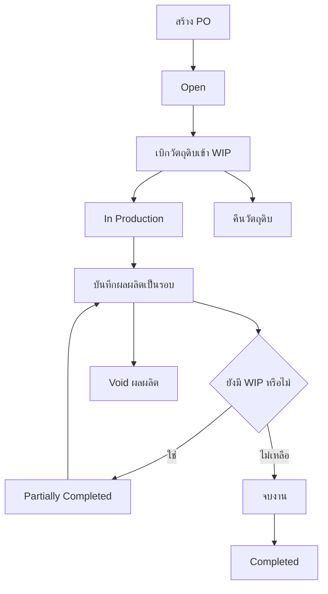

# Production Order DB/API Design / ใบสั่งผลิต

## Canonical Contract

ใบสั่งผลิต (`PO`) เป็น business document เดียวของหมวดผลิต เลข PO ต้องมีรหัสสาขา เช่น `PO012607-0003`. การเบิกวัตถุดิบ, การรับผลผลิต, การคืนวัตถุดิบ และการ void เป็น internal event ที่อยู่ภายใต้ PO ไม่ใช่เอกสารธุรกิจใหม่.

กติกานี้มีผลกับ flow ใหม่เท่านั้น:

- ไม่สร้างเลขเอกสาร `PI`, `PO2`, `PI-REV` หรือ `PO2-REV`
- รอบรับผลผลิตแสดงด้วย PO เดิมและ round เช่น `PO012607-0003/01`
- ledger/cost pool อ้าง `PO` เป็น business reference และอ้าง internal event/row id เพื่อระบุ movement จริง
- ค่า ref type/document key แบบเก่าที่อาจอยู่ในข้อมูลทดสอบหรือประวัติเดิมเป็น technical/legacy data สำหรับอ่านย้อนหลังเท่านั้น
- ไม่มี fallback เมื่อ branch/event identity หาย และไม่มีการ backfill ข้อมูลเก่าใน batch นี้

## Scope

MVP รองรับ:

1. สร้าง PO โดยยังไม่กระทบ stock
2. เบิกวัตถุดิบหลายรายการเข้า WIP
3. ผลิตหลายรอบ ได้ทั้งสินค้าหลัก สินค้าอื่น หรือสูญเสียทั้งหมด
4. รับ FG/RM เข้าคลังปลายทางทันทีเมื่อบันทึกผลผลิต
5. คืนวัตถุดิบที่เหลือจาก WIP ด้วย WAC ปัจจุบันของ WIP pool
6. void ผลผลิตที่ post แล้วเมื่อไม่มี downstream movement ที่ทำให้ยกเลิกไม่ได้
7. ปิดงาน โดยคืน WIP ที่เหลือกลับคลังต้นทางหลังผู้ใช้ยืนยัน
8. timeline, stock ledger และ reconciliation ที่ตรวจสอบย้อนกลับถึง PO/event

ไม่รวม approval, process cost allocation, customer return และการแก้ไข/ลบ ledger เดิมโดยตรง.

## Lifecycle

สถานะ MVP คือ `Open`, `In Production`, `Partially Completed`, `Completed` และ `Cancelled`.

## Create PO

Required: `branchCode`, `productId` (สินค้าเป้าหมาย), `machineCode`, `productionLineCode`, `shift` และข้อมูลหัวเอกสารตาม API schema. ตัวเลือกไม่มีเครื่องจักร/ไม่มีไลน์ผลิตถูกบันทึกเป็น `null` ตาม contract; หมายเหตุเป็น optional.

ผลลัพธ์การสร้าง:

- สร้าง `production_orders`
- generate branch-coded `doc_no`
- status เริ่มต้นเป็น `Open`
- ไม่เขียน stock ledger
- เขียน status/timeline event `created`

คลัง WIP และคลังวัตถุดิบต้อง resolve จาก branch ที่เลือกและตรวจซ้ำบน server. คลังรับผลผลิตเลือกตอนบันทึกผลผลิต เพื่อรองรับหลายรอบและหลายคลังภายในสาขาเดียวกัน.

## Input Event / เบิกวัตถุดิบเข้า WIP

`POST /api/production/orders/[docNo]/inputs` รับ `lines[]`. ทุก line ต้องมีสินค้า, ประเภท `RM`/`FG`, คลังต้นทาง และปริมาณที่มากกว่า 0. ปริมาณรวมต้องไม่เกิน stock พร้อมใช้ของคลังต้นทาง.

การบันทึกเป็น transaction เดียว:

| Movement | ผลกระทบ |
|---|---|
| `PRODUCTION_INPUT_OUT` | ตัด stock ออกจากคลังต้นทาง |
| `WIP_IN` | เพิ่มสินค้า/ประเภท/คลังต้นทางเดียวกันเข้า WIP |

ระบบเก็บ WAC ของคลังต้นทาง ณ เวลาที่เบิกเป็นต้นทุน snapshot ของ input และใช้รวมเป็น WIP pool ตาม `สินค้า + ประเภท + คลังต้นทาง`. ห้าม fallback ต้นทุนเป็นศูนย์.

## Output Event / ผลผลิต

`POST /api/production/orders/[docNo]/outputs` รับผลผลิตที่เตรียมไว้เป็นรายการ. หนึ่ง request คือหนึ่ง production round และมี output event identity เดียวกันทุก line.

- เลือก WIP source ได้หลายรายการ แต่ใช้ WIP รวมไม่เกินยอดคงเหลือ
- actual output product อาจเป็นสินค้าเป้าหมายหรือสินค้าอื่น
- ผลผลิตและ loss รวมกันต้องสัมพันธ์กับ WIP ที่ใช้; loss เป็น 0 ได้ และผลผลิตเป็น 0 ได้เมื่อสูญเสียทั้งหมด
- เมื่อผลผลิตไม่เท่ากับ WIP ที่ใช้ ระบบให้ผู้ใช้ยืนยันตาม quantity variance policy
- ผลผลิตที่มีจำนวนมากกว่า 0 ต้องเลือกคลังรับผลผลิตที่อยู่ในสาขาของ PO และไม่ใช่ WIP

เมื่อ post สำเร็จใน transaction เดียว:

| Movement | ผลกระทบ |
|---|---|
| `PRODUCTION_OUTPUT_WIP_OUT` | ตัด WIP ตาม source allocation |
| `PRODUCTION_OUTPUT_IN` / `PRODUCTION_OUTPUT_RM_IN` | รับ FG/RM เข้าคลังปลายทาง |
| `PRODUCTION_LOSS` | ตัด WIP เป็น loss โดยไม่มี stock-in |

ผลผลิตที่ post แล้วแก้ด้วยการ void แล้วสร้างรายการใหม่ หรือเพิ่มรอบใหม่เมื่อเป็นการผลิตเพิ่มจริง ห้ามแก้จำนวนใน ledger เดิม.

## Return And Void

`POST /api/production/orders/[docNo]/inputs/return` คืนวัตถุดิบจาก WIP pool ที่รวมแล้ว. เมื่อไม่สามารถระบุชั้นต้นทุนเดิมได้ ระบบใช้ WAC ปัจจุบันของ WIP pool ณ เวลาคืน. เขียนคู่ `PRODUCTION_INPUT_RETURN_WIP_OUT` และ `PRODUCTION_INPUT_RETURN_STOCK_IN` ใน transaction เดียวกัน โดยคงมูลค่ารวมและคำนวณ WAC คลังต้นทางใหม่.

`POST /api/production/orders/[docNo]/outputs/[outputRef]/void` ใช้ยกเลิก output event/round. Server ต้องตรวจ downstream stock usage, cost pool และสิทธิ์ก่อนเขียน ledger ชดเชย. Original output และ ledger เดิมยังอยู่เพื่อ audit; ไม่มีเลขเอกสาร reverse ใหม่.

เมื่อกดจบงานและ WIP ยังเหลือ ระบบต้องแสดงจำนวนให้ยืนยันก่อน แล้วคืนยอดเหลือกลับคลังต้นทางใน transaction เดียวกันก่อนเปลี่ยนเป็น `Completed`.

## API Surface

| Method | Endpoint | Contract |
|---|---|---|
| `GET` | `/api/production/orders` | list/detail/filter PO |
| `POST` | `/api/production/orders` | create PO |
| `PATCH` | `/api/production/orders/[docNo]` | update header, complete/cancel |
| `POST` | `/api/production/orders/[docNo]/inputs` | post input event |
| `POST` | `/api/production/orders/[docNo]/inputs/return` | post return event |
| `POST` | `/api/production/orders/[docNo]/outputs` | post output round |
| `POST` | `/api/production/orders/[docNo]/outputs/[outputRef]/void` | void output event |
| `GET` | `/api/production/orders/options` | scoped form options |
| `GET` | `/api/production/orders/product-stock` | current stock fact |
| `GET` | `/api/production/orders/[docNo]/wip` | current WIP summary |
| `GET` | `/api/production/reconciliation` | PO/event/ledger reconciliation |

API ไม่เปิด route สำหรับสร้าง reverse document และไม่รับเลข PI/PO2 เป็น business document input.

## Data And Validation Rules

- DB เป็น source of truth สำหรับ stock, WAC, ledger, permission และ transaction status; ห้าม cache ข้อมูลเหล่านี้
- ทุก write ใช้ server transaction, advisory lock ตาม PO/stock scope และ append-only timeline/ledger
- validate branch, warehouse, product, quantity, WAC, status และ downstream dependency ทั้ง server และ client
- WIP dimension ต้องใช้ source product/category/warehouse ของ input ไม่ใช้สินค้าเป้าหมายมาแทน
- ledger pair ต้อง balance และต้องตรวจ reconciliation หลัง write
- historical label ใช้ snapshot/active-all reader ให้ถูกกับเอกสาร ห้าม map ด้วย active-only cache

## Required Verification

ก่อน promotion ต้องตรวจ:

1. authenticated UAT: create PO, multi-line input, multi-round output, loss-only, return, void guard และ complete-with-WIP-return
2. ledger reconciliation ก่อน/หลังทุก event และตรวจ timeline actor/time/reason
3. duplicate/unique contract ของ `production_orders.doc_no` และ event identity ใน DB แบบ read-only ก่อนเพิ่ม constraint
4. type-check, lint, build, focused tests และ `git diff --check`

ข้อมูลทดสอบเก่าจะไม่ถูก migrate/backfill ใน batch นี้; หากพบข้อมูลซ้ำให้บันทึกเป็น data-cleanup task แยกต่างหาก.
