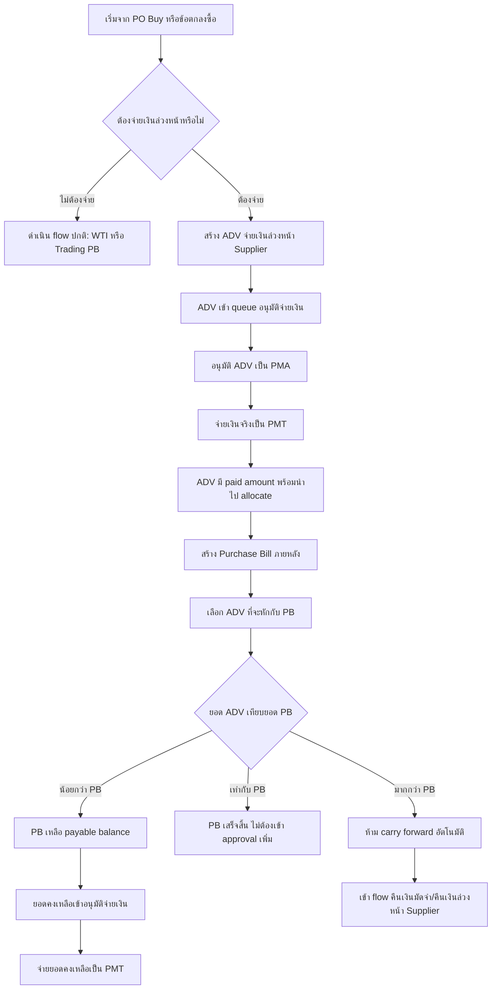

# Supplier Advance Payment Flow / จ่ายเงินล่วงหน้า Supplier

เอกสารนี้เป็น flow เฉพาะของ `จ่ายเงินล่วงหน้า / มัดจำ Supplier` (`ADV`) เพื่อแยก rule ออกจาก `PO Buy`, `Purchase Bill`, และ `Payment Flow` แต่ยังเชื่อมกันในภาพรวมซื้อ

เอกสารที่เกี่ยวข้อง:

- [[Purchase Flow]] สำหรับภาพรวม `PO Buy -> WTI -> Purchase Bill -> Approval -> Payment`
- [[Payment Flow]] สำหรับ `PMA`, `PMT`, queue อนุมัติจ่ายเงิน, รอจ่าย, และประวัติการจ่ายเงิน

## ขอบเขต

ใช้เมื่อบริษัทต้องจ่ายเงินให้ Supplier ก่อนออก `บิลรับซื้อ` เต็มใบ เช่น:

- มี `PO Buy` แล้ว และตกลงจ่ายมัดจำก่อน Supplier ส่งของ
- รถเข้าของแบบชั่งน้ำหนักรวมจากเครื่องชั่งใหญ่ แต่ยังไม่ได้แตกชั่งย่อย/ตรวจสอบละเอียดใน `WTI`
- ต้องจ่ายบางส่วนก่อน แล้วค่อยออก `Purchase Bill` หลังข้อมูลรับของหรือ trading bill สมบูรณ์

`ADV` เป็น source document ฝั่งจ่ายเงินของตัวเอง ไม่ใช่ `PMA` และไม่ใช่ `PMT`

## Mermaid Flow

## เอกสารและสถานะ

| เอกสาร | หน้าที่ | สถานะหลัก |
|---|---|---|
| `POB` | ต้นทางสั่งซื้อ/จองซื้อ ถ้ามี PO | `เปิดอยู่`, `ออกบิลบางส่วน`, `ออกบิลแล้ว`, `ปิดรับไม่ครบ` |
| `ADV` | source document ของเงินล่วงหน้า Supplier | `บันทึกแล้ว`, `รอจ่าย`, `เสร็จสิ้น`, `ยกเลิกแล้ว` |
| `PMA` | approval snapshot ของ ADV หรือยอดคงเหลือ PB | `อนุมัติแล้ว`, `จ่ายแล้ว` หรือสถานะตาม Payment Flow ล่าสุด |
| `PMT` | voucher จ่ายเงินจริง | `เสร็จสิ้น`, `ยกเลิกแล้ว` |
| `PB` | บิลรับซื้อที่นำ ADV ไปหักภายหลัง | `ยังไม่อนุมัติ`, `รอจ่าย`, `ชำระบางส่วน`, `เสร็จสิ้น`, `ยกเลิก` |

## ข้อมูลขั้นต่ำของ ADV

ข้อมูลการเงิน:

- Supplier
- สาขา
- วันที่จ่าย
- วิธีจ่าย
- บัญชีที่จ่าย
- ยอดจ่ายล่วงหน้า
- หมายเหตุ
- เอกสารอ้างอิง เช่น `POB`, ใบชั่งน้ำหนักใหญ่, หรือเลขอ้างอิงจาก Supplier

ข้อมูลต้นทางจากใบชั่งน้ำหนักใหญ่ ถ้ามี:

- เลขที่เอกสารใบชั่งน้ำหนักใหญ่
- วันที่เข้า
- วันที่ออก
- ทะเบียนรถ
- รูปรถ
- ชื่อสินค้า
- น้ำหนักเข้า
- น้ำหนักออก
- น้ำหนักสุทธิ
- ราคา/กก.
- ผู้ชั่งน้ำหนัก
- ผู้ส่ง
- พนักงานขับรถ

## Rule การจ่าย ADV

- หลังบันทึก ADV ต้องเข้า `/daily/payment-approval`
- ผู้อนุมัติสามารถ split ADV เป็นหลาย approval item ได้
- แต่ละ approval item ต้องไปเป็นรายการรอจ่ายใน `/purchase/payments`
- เมื่อทำจ่ายสำเร็จ ต้องเกิด `PMT`
- ADV ที่ยังไม่จ่ายสำเร็จ ห้ามนำไป allocate หักกับ PB
- ถ้า PMT ของ ADV ถูกยกเลิก ให้ถือว่า ADV กลับไปต้องอนุมัติใหม่; PMA เดิมใช้เป็น audit/history เท่านั้น และต้องสร้าง PMA ใหม่ก่อนจ่าย ADV ใหม่

## Rule การ allocate ADV เข้าบิลรับซื้อ

- `PB` 1 ใบอาจใช้ ADV ได้หลายรายการ
- `ADV` 1 รายการอาจถูกใช้กับ PB เดียวหรือหลาย PB ได้ตาม policy ที่จะออกแบบต่อ
- ต้องกันไม่ให้ allocate ADV เกินยอดจ่ายจริงที่ยังเหลือ
- ยอดเจ้าหนี้สุทธิของ PB = `ยอดบิลเต็ม - ยอด ADV ที่ allocate`
- ถ้ายอดเจ้าหนี้สุทธิ `> 0` ให้ยอดคงเหลือเข้า `/daily/payment-approval`
- ถ้ายอดเจ้าหนี้สุทธิ `= 0` ให้ PB เป็น `เสร็จสิ้น` และไม่ต้องเข้า approval เพิ่ม
- ถ้า ADV มากกว่า PB ห้าม carry forward เป็นเครดิต Supplier อัตโนมัติ ต้องเข้า flow `คืนเงินมัดจำ/คืนเงินล่วงหน้า Supplier`

## Traceability ที่ต้องเห็น

ในรายละเอียดเอกสารควร trace ได้อย่างน้อย:

- `POB` ใดเป็นบริบทของ ADV ถ้ามี
- `ADV` ใดถูกจ่ายด้วย `PMA/PMT` ใด
- `ADV` ใดถูก allocate เข้า `PB` ใด
- ยอด ADV เดิม, ยอดใช้แล้ว, ยอดคงเหลือ
- ถ้า PB ถูกยกเลิก ต้องมี rule คืนยอด ADV allocation ให้ถูกต้องตาม policy และ audit trail

## Open Decisions

- จะให้ `ADV` 1 รายการ allocate ข้ามหลาย PB ได้ทันทีหรือจำกัด 1 ADV ต่อ 1 PB ใน phase แรก
- route สำหรับ `คืนเงินมัดจำ/คืนเงินล่วงหน้า Supplier`
- policy เมื่อ PB ถูกยกเลิกหลังมี ADV allocation แต่ยังไม่มี payment ยอดคงเหลือ
- report/reconciliation สำหรับ `POB -> ADV -> PMT -> PB`
