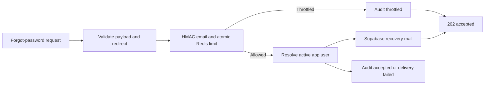

# Auth Edge Hardening Design

**Status:** Approved for planning and implementation

## Goal

Reduce abuse, privacy, cache, and reliability risks around login and password-recovery entry points without changing the existing password-completion or invitation-activation lifecycle.

## Scope

Included:

- Rate-limit public forgot-password requests with Redis.
- Remove raw public email values from reset audit metadata and Redis keys.
- Return non-cacheable HTTP responses for auth/session/permission facts.
- Validate an existing browser session against the app-user login contract before redirecting away from `/login`.
- Replace raw Supabase error text in password UIs with stable Thai copy.
- Add focused route and client-contract tests.
- Record the deployment configuration required for the hardening controls.

Excluded:

- Replacing the client-owned password update mechanism.
- Redesigning `/api/auth/password-changed`.
- Changing invitation activation rules.
- New database tables or migrations.

## Deferred Critical Risk

`POST /api/auth/password-changed` currently changes `app_users.must_change_password` without proof that a password update succeeded. The proxy explicitly allows this endpoint while the flag is true. This remains a **P0 deferred security issue**. This design must not claim to resolve it; a later dedicated password-completion design will replace the route and its proxy allowlist.

## Security And Reliability Contracts

### Forgot Password

1. The request body remains an email plus a same-origin `/reset-password` redirect target.
2. Invalid request shapes return `400` with the existing validation message.
3. Valid request shapes always return `202 { accepted: true }`, regardless of whether an active account exists, the request is throttled, or delivery is suppressed. The response must not reveal account existence or throttle state.
4. A request is admitted only when both limits permit it:
   - source IP: at most 10 requests in 15 minutes;
   - normalized email fingerprint: at most 3 requests in 30 minutes.
5. The email rate key is an HMAC-SHA-256 fingerprint of the lowercased, trimmed email using required environment variable `AUTH_RATE_LIMIT_SECRET`. Raw email is never a Redis key.
6. If Redis is unavailable, returns an invalid value, or `AUTH_RATE_LIMIT_SECRET` is missing, the endpoint returns `503` and does not call Supabase. This is fail-closed; no silent protection bypass is allowed.
7. Audit records may include source, identifier type, IP, user agent, target app-user id when resolved, and outcome (`accepted`, `throttled`, `delivery_failed`). They must not contain the submitted email or an equivalent reversible identifier.
8. The Supabase delivery error remains private. The response remains generic and the structured server log contains only an error code/category, never the email or reset URL.

### Login With Existing Browser Session

1. `/login` may detect an existing Supabase session.
2. Before redirecting, it calls `POST /api/auth/login-complete`.
3. A successful contract response permits redirect to a validated same-origin path.
4. A failed contract response clears only the local Supabase session and presents the standard Thai login-contract error. It must not redirect repeatedly.
5. This behavior is equivalent to a fresh password login with respect to active application-user validation and login audit recording.

### Auth Response Caching

The following responses explicitly set `Cache-Control: private, no-store`:

- `GET /api/auth/me`
- `POST /api/auth/login-complete`
- `POST /api/auth/forgot-password`
- `POST /api/auth/password-changed`

This is a response policy only. It does not alter the deferred password-completion state transition.

### UI Error Copy

- Password update failures display stable Thai messages classified as validation, expired/invalid recovery session, network, or generic provider failure.
- The UI never renders `error.message` supplied by Supabase.
- The existing password policy and form validation remain unchanged.

## Architecture

### New Server Units

- `auth-response.ts`: creates JSON responses with the auth `private, no-store` policy and no raw provider error leakage.
- `auth-rate-limit.ts`: owns normalization, HMAC fingerprinting, Redis atomic counter operations, and typed outcomes. It consumes existing Redis environment configuration but does not use reference-master cache helpers.

The public forgot route orchestrates these units. It remains the only caller of the forgot-password limiter, so unrelated public APIs do not inherit accidental policy.

## Environment Contract

`AUTH_RATE_LIMIT_SECRET` is required in local, dev, SIT, and UAT environment configuration. It is a server-only secret and is never prefixed with `NEXT_PUBLIC_`, committed, logged, or returned by an API.

Redis URL/token configuration remains the source of connectivity. The deployment checklist must confirm both the secret and Redis connectivity before enabling the route in each environment.

## Test Strategy

1. Unit test email normalization and deterministic HMAC fingerprinting without exposing the secret.
2. Route tests verify both limiter dimensions, generic accepted responses, fail-closed `503`, redirect validation, and the guarantee that raw email is absent from audit payloads.
3. Route tests verify all four auth routes set `private, no-store`.
4. Client tests verify stale-session auto-redirect invokes login completion and signs out/displays an error when it fails.
5. Client tests verify password pages map provider failures to stable Thai messages and do not render provider text.
6. Existing login, logout, recovery link, forced-password, and invitation flows require manual UAT after deployment. The forced-password bypass remains an expected failing security case until the deferred design is completed.

## Acceptance Criteria

- A public reset request cannot generate unbounded email sends from one IP or one email target.
- A public reset audit event never persists a submitted raw email.
- Missing limiter configuration prevents email sending with HTTP 503.
- Auth session/permission API responses cannot be stored by browser/shared caches.
- A stale browser session cannot skip the active app-user contract on the login page.
- Password UI exposes no raw Supabase provider message.
- Deferred P0 is visible in the auth batch tracker and release notes for this batch.

## Implementation Checkpoint 2026-07-19

- Implemented in commits `27a7795e` (Redis limiter and audit privacy), `bcc73466` (auth no-store response policy), `599134de` (existing-session contract), and `2a66879e` (password UI acknowledgement and stable error copy).
- Deployment requires server-only `AUTH_RATE_LIMIT_SECRET` plus Redis `KV_REST_API_URL` and `KV_REST_API_TOKEN` in every environment that serves `/api/auth/forgot-password`.
- No database migration was created or applied.
- Validation is recorded with the implementation batch; browser/UAT verification remains required after deployment for login, recovery link, forced-password, and invitation flows.
- The deferred P0 password-completion proof gap remains open and is not resolved by this implementation.
